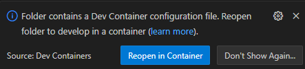

> Written with [StackEdit]

Este repositório contém os arquivos necessários para criar containers Docker para:

 - Spark Master (v. 3.5.1)
 - Spark Worker
 - Spark History Server
 - Jupyter Notebook

## Pré-requisitos

- Docker instalado

## Estrutura dos arquivos

- `docker-compose.yaml`: Define os serviços Docker para Spark Master, Spark Workers e Jupyter Notebook.
- `dockerfile-jupyter`: Dockerfile para construir a imagem do Jupyter Notebook.
- `dockerfile-spark`: Dockerfile para construir a imagem do Spark.

## Como usar o Docker Compose

### Subindo os containers

1. Clone o repositório:

    ```bash
    git clone https://github.com/airtoncarneiro/dev-spark-jupyter
    cd dev-spark-jupyter
    ```

2. Para iniciar os containers com 1 worker, execute:
    ```bash
    docker compose up -d
    ```

3. Para iniciar os containers com um ou mais workers, utilize a variável de ambiente `WORKERS` para definir o número de workers desejados. Por exemplo, para iniciar com 2 workers:
    ```bash
    docker compose up -d --scale worker=2
    ```
    *Se não quiser worker: --scale worker=0*


### Parando/Desfazendo os containers:

1. Parar o container e, além de mantê-lo, permanecem a rede e o volume:
    ```bash
    docker compose stop
    ```
2. Remover o container (desfaz tudo):
    ```bash
    docker compose down
    ```

## Acessando as interfaces web

- **Spark Master**:
    - URL: [http://localhost:8080](http://localhost:8080)
    - Interface web do Spark Master para monitoramento do cluster.

- **Jupyter Notebook**:
    - URL: [http://localhost:8888](http://localhost:8888)
    - Interface web do Jupyter Notebook para executar notebooks interativos.

- **Spark History Server**:
    - URL: [http://localhost:18080](http://localhost:18080)
    - Interface web do Spark History Server para visualizar o histórico de execuções de jobs.
    - Os logs são armazenados no diretório `./logs` do Host

## Usando o VSCode (devcontainer)

Ao abrir o projeto no VSCode surgirá uma mensagem solicitando para abrir no _devcontainer_. Basta aceitar que todo o ambiente será montado automaticamente e você poderá usar o Jupyter integrado ao VSCode.
Editar o arquivo _docker_compose_override.yaml_ caso queira alterar as configurações padrões que foram estabelecidas no _docker-compose.yaml_.




## Personalização

Você pode personalizar as configurações dos containers editando os arquivos `docker-compose.yaml`, `dockerfile-jupyter` e `dockerfile-spark` conforme necessário.

Por exemplo: Se quiser alterar a quantidade de memória ou cores do Spark Worker, ajuste os valores das variáveis de ambiente `SPARK_WORKER_MEMORY` e `SPARK_WORKER_CORES` no `docker-compose.yml`

```yaml
environment:
  - SPARK_MODE=worker
  - SPARK_WORKER_MEMORY=1G  # Altere este valor para ajustar a memória (ex: 2G)
  - SPARK_WORKER_CORES=1    # Altere este valor para ajustar o número de núcleos (ex: 2)
```

## Contribuições

Contribuições são bem vindas! Sinta-se à vontade para sugerir melhorias ou novos ambientes.

## Nota

[2024-06-02] Inclusão do **Spark Measure**
Caso queira fazer uso, veja um exemplo:
    
```python
from sparkmeasure import StageMetrics
stagemetrics = StageMetrics(spark)

query = """
spark.sql("select count(*) \
from range(1000) \
cross join range(1000) \
cross join range(1000)").show()
"""

stagemetrics.runandmeasure(globals(), query)
```
e inclua o código abaixo no SparkSession:
```bash
.config("spark.jars", os.environ.get("JARS_USER_DIR"))
```
---
[2024-06-14]
1. Mudança de Jupyter para Jupyter Lab como default
2. Disponibilização de um devcontainer para o VSCode